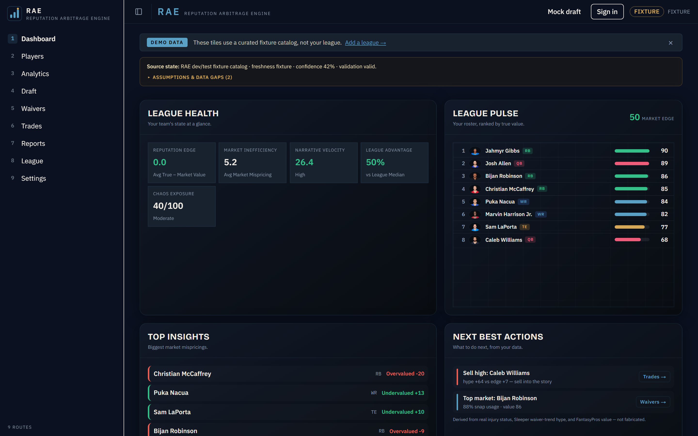
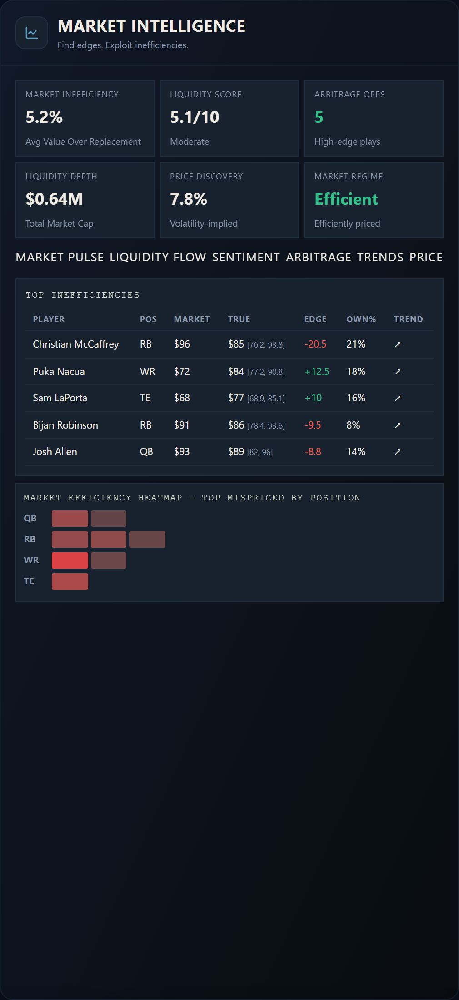
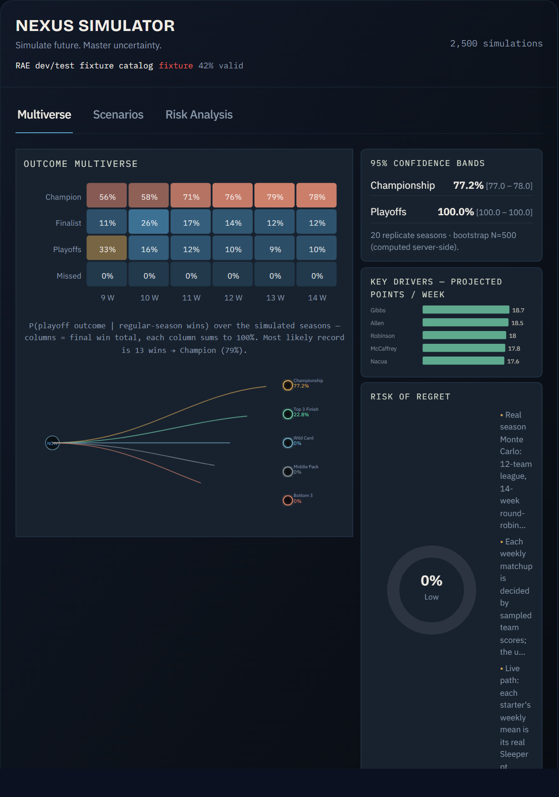
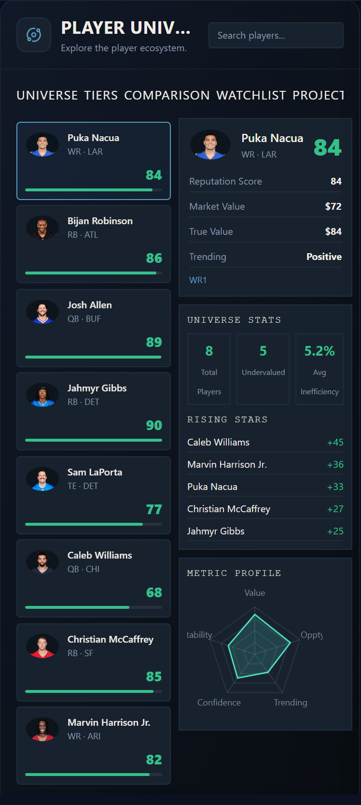

<p align="center">
  
</p>

<h1 align="center">RAE — Roster Analytics Engine</h1>

<p align="center">
  <b>Quant fantasy-football intelligence.</b><br>
  Honest data, no fabrication — every number is derived from a real source or an explicitly-labeled demo fixture.
</p>

<p align="center">
  <sub><b>Renamed 2026-08-22.</b> RAE was the <i>Reputation Arbitrage Engine</i>.
  A frozen out-of-sample test on 115 real drafts found the reputation edge does
  not identify mispriced players — within a position it was inverted — so the
  product no longer claims an arbitrage it cannot demonstrate.
  Evidence: <a href="reports/2026-08-20/holdout-result-3.md">holdout-result-3.md</a>.</sub>
</p>

<p align="center">
  <a href="https://github.com/jviola1019/fantasy_football_dashboard/actions/workflows/ci.yml"></a>
  
  
  
  <a href="https://github.com/jviola1019/fantasy_football_dashboard/actions/workflows/ci.yml"></a>
  <a href="https://github.com/jviola1019/fantasy_football_dashboard/actions/workflows/ci.yml"></a>
  
</p>

<p align="center">
  
</p>

<table>
  <tr>
    <td width="50%"><br><sub><b>Dashboard</b> — League Health KPIs, League Pulse rankings, Top Insights, Next Best Actions</sub></td>
    <td width="50%"><br><sub><b>Market Intelligence</b> — mispricing leaderboard + sortable Value × Usage board</sub></td>
  </tr>
  <tr>
    <td width="50%"><br><sub><b>Nexus Simulator</b> — season Monte Carlo: P(outcome | wins) heatmap + server-computed confidence bands</sub></td>
    <td width="50%"><br><sub><b>Player Universe</b> — searchable universe, tiers, comparison radar, projections</sub></td>
  </tr>
</table>

---

RAE is a fantasy football behavioral-market intelligence operating system. It is designed around perception asymmetry, narrative propagation, market inefficiency, volatility, uncertainty, fragility, survivability, leverage, chaos exposure, and reproducible simulation.

## Architecture overview

RAE uses Next.js, TypeScript, Tailwind CSS v4 + shadcn/ui (Radix) for the shell, Zod validation, and deterministic simulation utilities. See **Design system** below for how the Tailwind layer coexists with the legacy CSS-variable theme.

Service boundaries:
1. **Frontend app** — a multi-route SaaS shell (Next.js App Router route group `src/app/(app)`): an onboarding home (`/`), an overview `/dashboard` (Command Center + source-backed Next Best Actions), and per-system deep routes `/players`, `/analytics` (Market Intelligence + Nexus Simulator + Narrative Engine), `/draft` (Draft Intelligence + Pre-Draft Audit), `/waivers`, `/trades`, and `/reports`. A collapsible route sidebar + slim command bar + mobile bottom nav wrap every route, with the model-governance banner always visible.
2. **Data adapter layer** — adapter isolation begins with the Sleeper public players API boundary in `src/lib/sleeper.ts`.
3. **API abstraction/governance layer** — `src/lib/governance.ts` defines source metadata, freshness, missingness, confidence, validation state, and bounded cache key behavior. See `docs/data-source-map.md` for the per-metric provenance map.
4. **Simulation engine** — `src/lib/simulation.ts` provides seeded Monte Carlo primitives, parameter logging, replayability, and assumptions.
5. **Rendering pipeline** — one request-cached resolver `src/lib/envelope/load.ts` (`loadEnvelope()`) feeds every route; `src/lib/envelope/derive.ts` (`deriveAppData`) computes pools/sim/metrics; `src/components/app/RouteView.tsx` and `ReportsView.tsx` are **server components** that run the seeded sim + bootstrap confidence bands on the server and stream plain data to the `"use client"` panels — so a ~2,500-iteration season Monte Carlo never blocks the client main thread (the panels only handle interactivity). Every panel reads from this one shared derivation, enforced by `src/lib/envelope/continuity.test.ts`.
6. **Audit layer** — docs and UI banners expose stale, fixture, missing, unavailable, and validation states; an assumptions disclosure + ⓘ lineage tooltips surface assumptions and provenance at the point of use.

## Data sources

Preferred production adapters:
- Sleeper API for public identity/league data where permitted.
- NFLverse/nflfastR/nflreadr for historical and projection features.
- Weather, injury, RSS/news, and sentiment feeds where legal and available.

Current implementation (all FREE — no paid feeds, no API keys beyond what's noted):
- **Sleeper** — identity/league/rosters, weekly projections (`api.sleeper.com`), 24h trending adds/drops (`trendingMomentum` proxy).
- **FantasyPros** — consensus ECR/ADP per scoring (PPR / Half / Standard) → value, draft pool, the league universe.
- **nflverse** — free, CC-BY snap counts → a real `opportunity` (role/usage) score, stamped onto records by the `/api/cron/opportunity-refresh` snapshot (`src/lib/nflverse/`). Replaces any paid snap-share/target-share feed; see [docs/data-sources.md](docs/data-sources.md) for the full free-source matrix.
- **ESPN** — private-league rosters (encrypted cookies) + public news headline-velocity (a second `trendingMomentum` source).
- **open-meteo** weather, FantasyCalc/KTC/DynastyProcess trade values — all free.
- RAE still refuses to infer a metric it has no source for: any field without real data is declared in `missingFields` and renders "—", never a fabricated number.
- Development fixtures exist only as clearly labeled dev/test fixtures. Enable with `RAE_ALLOW_FIXTURES=true`.

## Environment variables

| Variable | Required | Purpose |
| --- | --- | --- |
| `AUTH_SECRET` | Yes (prod/dev) | Auth.js session signing key. Generate with `node -e "console.log(require('crypto').randomBytes(32).toString('base64'))"`. |
| `DATABASE_URL` | No (defaults to `file:.data/rae.sqlite`) | SQLite for dev, Postgres URL for production (Vercel Marketplace Postgres / Neon). |
| `CREDENTIAL_ENCRYPTION_KEY` | Yes | Base64-encoded 32 bytes. Encrypts ESPN cookies and OAuth tokens at rest with AES-256-GCM. |
| `RAE_ALLOW_FIXTURES` | No | `true` to render clearly labeled dev/test fixture records. Defaults to unavailable/missing states. |
| `RAE_LIVE_TESTS` | No | `1` to enable live API round-trip vitest specs. |
| `RAE_LIVE_SLEEPER_LEAGUE_ID` | No | Public Sleeper league for live tests. |
| `ESPN_S2`, `ESPN_SWID`, `ESPN_LEAGUE_ID`, `ESPN_SEASON` | No | Live ESPN private-league round-trip tests. |

Secrets and API keys must remain server-side. Do not expose league tokens or paid data credentials through `NEXT_PUBLIC_*` variables.

## Auth and league connection

RAE ships multi-user authentication via Auth.js (NextAuth v5) with the Drizzle adapter (SQLite locally, Postgres in production).

- Passwords are hashed with scrypt (`src/lib/passwords.ts`) — plaintext is never stored.
- ESPN private-league cookies (`espn_s2` + `SWID`) are encrypted at rest with AES-256-GCM (`src/lib/crypto.ts`) and never returned to the browser after creation. They are decrypted only inside the server-only `/api/leagues/[id]/refresh` route.
- Sleeper integration uses public endpoints (no auth required).
- Visit `/login` to sign up, `/settings/leagues` to add leagues, and `POST /api/leagues/[id]/refresh` to pull the live envelope for a specific league.
- Sign-in errors never echo Auth.js internals — `src/lib/auth/errors.ts` maps every failure class to a friendly string.
- Per-account isolation is enforced at the query layer; `e2e/07-no-shared-data.spec.ts` and `docs/account-isolation.md` are the regression gate.

The topbar shows the signed-in user's avatar + email + sign-out when authenticated, and a "Sign in" CTA when not. A persistent **DEMO DATA** banner sits above the dashboard whenever the envelope is fixture-mode, so a signed-in user is never confused about whether the tiles reflect their own league.

The full Sleeper and ESPN adapter surfaces are in `src/lib/sleeper/` and `src/lib/espn/` and produce records that pass `PlayerMarketRecordSchema` via `src/lib/normalize.ts`. Behavioral-market metrics still default to zero (unavailable) — RAE refuses to fabricate them from identity records alone.

## Local setup

```bash
npm install
npm run dev
```

Open `http://localhost:3000`.

## Exact run commands

Every script in `package.json`, grouped by what it is for. All 20 are listed —
an earlier version of this section named only nine, so the security gates and
model harnesses were effectively undiscoverable.

### Everyday

```bash
npm install
npm run dev          # next dev
npm run build        # next build
npm run start        # next start (serves the build; used by e2e/lighthouse)
```

### Gates — run these after meaningful changes

```bash
npm run typecheck    # tsc --noEmit
npm run lint         # eslint .
npm run test         # vitest run
npm run test:watch   # vitest, watch mode
npm run e2e          # playwright (needs a build; npm run e2e:install first time)
npm run e2e:install  # playwright install --with-deps chromium
npm run lighthouse   # lhci autorun against next start
```

### Security gates

```bash
npm run check:secrets     # scan tracked files for secret-shaped literals
npm run check:advisories  # fail if the lockfile resolves below an advisory floor
npm run check:exceptions  # fail on an expired vulnerability exception
```

### Model harnesses

These reach the network (public Sleeper data, no credentials) and are therefore
reported, not CI-blocking.

```bash
npm run backtest:valuation       # out-of-sample backtest of the SHIPPED chain
npm run sensitivity:replacement  # sweep the two replacement-model assumptions
npm run calibrate:season         # synthetic self-consistency check
npm run backtest:sleeper         # season-sim backtest on real weekly scores
```

### Gated suites (skipped in CI by design)

Live-network, Postgres and Lighthouse suites need real credentials, a real
database or a browser, so CI skips them. They were executed on 2026-08-22 and the
results — including a live test that could never have passed, and the hype-axis
asymmetry it exposed — are in
[`reports/2026-08-20/gated-suite-verification.md`](reports/2026-08-20/gated-suite-verification.md).

```bash
RAE_LIVE_TESTS=1 npx vitest run src/lib/schedule/schedule.live.test.ts src/lib/trade/values.live.test.ts
RAE_PG_TEST_URL=postgres://... npx vitest run src/db/postgres.integration.test.ts
npm run lighthouse
```

### Frozen holdout protocols

Four protocols were each **frozen and committed before any metric was computed**,
then executed once. Index and verdicts:
[`reports/2026-08-20/README.md`](reports/2026-08-20/README.md).

```bash
npm run holdout:evaluate         # protocol 1 — shipped season model
npm run holdout:evaluate2        # protocol 2 — larger external holdout
npm run holdout:evaluate3        # protocol 3 — the reputation edge
npm run holdout:acquire-usage    # protocol 4 — fetch/archive nflverse usage data
npm run holdout:evaluate4        # protocol 4 — does opportunity add over production?
npm run holdout:evaluate4 -- --self-test   # arithmetic only; never touches the data
```

Each reproduces from a committed archive with no network. **Protocol 4 is the only
one that passed** — in-season opportunity adds beyond points scored to date
(partial ρ 0.2289, holding within position, 452 players). Its out-of-fold gain is
**+0.0137** and its scope is **in-season only**; see
[`holdout-result-4.md`](reports/2026-08-20/holdout-result-4.md) before relying on
it.

**Read [`reports/2026-08-06/backtest-valuation.md`](reports/2026-08-06/backtest-valuation.md)
before trusting any probability this app displays.** The shipped valuation chain
fails out-of-sample: Brier 0.3098 against a 0.2400 climatology baseline, AUC
0.3058 with a 95% CI of [0.1333, 0.4450] — significantly worse than forecasting
the league base rate. The simulation declares this in its own assumptions.

### Operations

```bash
npm run smoke            # smoke-check a Vercel deployment
npm run check:freshness  # probe the DEPLOYED app's snapshot freshness (needs CRON_SECRET)
npm run verify:rotation  # prove a rotated secret's PREVIOUS value is now rejected
npm run deploy           # currently aliases `next build` — see below
```

`verify:rotation` reads secrets from the environment only, never prints them, and
refuses plaintext http. It asserts the **old** credential returns 401/403, which
is the only direct evidence a rotation took effect — confirming the new value
works proves only that it was accepted. Full procedure:
[`docs/runbooks/secret-rotation.md`](docs/runbooks/secret-rotation.md).

`npm run deploy` currently aliases build validation. Wire it to Vercel, Docker, or another deployment target once production infrastructure is selected.

## Production deployment

Recommended production path:
1. Configure server-side API credentials in the hosting provider secret manager.
2. Keep `RAE_ALLOW_FIXTURES=false`.
3. Add persistent cache/database storage if adapter throughput exceeds in-memory or platform cache limits.
4. Run `npm run test`, `npm run lint`, `npm run typecheck`, and `npm run build` in CI.
5. Deploy through Vercel or a containerized Next.js host.

## League connection

Private-league connection is implemented (see **Auth and league connection** above):
1. ESPN private-league cookies (`espn_s2` + `SWID`) are pasted by the user at `/settings/leagues`.
2. They are encrypted at rest with AES-256-GCM (`src/lib/crypto.ts`) in the `leagueCredentials` table.
3. Decryption happens only server-side, only after the per-user ownership check, inside `src/lib/leagues/fetchLive.ts` and the `/api/leagues/[id]/refresh` route.
4. The client only ever receives derived, validated league state — never the credentials.

Sleeper leagues need no credentials (public API). Yahoo is the one platform still deferred — it requires a registered Yahoo developer app for OAuth.

## Simulation methodology

The Nexus Simulator runs a **real season Monte Carlo** (`src/lib/seasonSim.ts`):
every simulated season plays a full round-robin schedule, each weekly matchup is
decided by sampled team scores, standings seed a single-elimination playoff
bracket (byes for top seeds), and the bracket winner is champion. Championship /
playoff probabilities are genuine simulated frequencies, not a threshold
heuristic. It uses:
- deterministic Mulberry32 PRNG + Box–Muller normal sampling,
- a two-level model (between-team strength + within-team weekly variance),
- league parameters (teams / playoff spots / weeks) from your connected league,
- the team's real Sleeper `pts_ppr` projections on the live path,
- assumptions attached to every result.

**Calibration anchor:** a league-average roster makes the playoffs ≈
`playoffTeams / numTeams` of the time. The opponent field is modeled as a
distribution (RAE only has your roster in detail), so those constants are the
documented assumption. See **[docs/season-sim.md](docs/season-sim.md)** for the
full methodology and the calibration contract enforced by the test suite.

## Trade value simulator

The Trade Center (`src/components/panels/TradeCenter.tsx`) lives on the `/trades` route, backed by real market data through a three-tier source chain: the **FantasyCalc** free API (primary), a cached **KeepTradeCut** snapshot (secondary), and a **DynastyProcess** CSV (tertiary fallback) — no API keys and no paid feeds required. It has two tabs:

- **Trade Builder** — search players by name, build two sides of a trade, and get a live fairness verdict (balanced / slight-edge / lopsided) based on market trade values (which are position-aware at the source).
- **Recent League Trades** — grades real transactions pulled from a connected **Sleeper or ESPN** league, showing the value each side received and the verdict for each executed trade.

League format (PPR / Superflex / team count) is auto-detected at league-add time via the Sleeper public API or ESPN `mSettings` and persisted per league. The format feeds the value weights used in both the Trade Builder and the grading engine.

See `docs/trade-calibration.md` for the full backtest and validation methodology (concurrent-validity Spearman ρ ≈ 0.65 across 784 player-seasons pooled from four independent seasons, 2022–2025).

## Draft systems

Draft Intelligence lives on the `/draft` route (`src/components/panels/DraftIntelligence.tsx`, rendered by `RouteView`). It ships with:
- Live Board — click rows to draft to your roster.
- Recommendation Queue — categories (`Value`, `Need`, `Stash`, `Run`) with a deterministic scoring function in `src/lib/draft/recommend.ts`.
- Tier Collapse Forecast — per-position tier breaks and intensity, from `src/lib/draft/tiers.ts`.
- 2-D Draft Board — ranked player list with position colors and draft-pick tracking.

Recommendation and tier logic are pure functions with unit tests in `src/lib/draft/*.test.ts`. Live draft ingestion can be wired by calling `getDraftPicks(draftId)` (Sleeper) or `getDraft(client, { leagueId, season })` (ESPN) and feeding the result into the panel.

## Stale-data handling

Every source envelope exposes:
- source,
- fetched timestamp,
- TTL,
- freshness state,
- confidence,
- validation status,
- missing fields,
- assumptions,
- failure conditions.

Freshness states are `fresh`, `stale`, `missing`, `unavailable`, and `fixture`.

## Design system

The shell, navigation, panel grid, and shared panel chrome are built on **Tailwind CSS v4 + shadcn/ui** (Radix primitives, `new-york` style). The data internals — KPI strips, dense tables, charts, and the WebGL canvases — stay on the original `globals.css` classes, which already match the blueprint's data-dashboard density.

- **Token bridge** — the legacy `:root` CSS variables (`--bg`, `--panel`, `--cream`, `--muted`, the position-color ramp) remain the single source of truth. The shadcn tokens are defined alongside them in a Tailwind `@theme` block as a separate `--color-*` namespace, so the two systems share colors without collision (notably legacy `--muted` is a text color, shadcn `--color-muted` is a surface).
- **Coexistence** — `globals.css` prepends `@import "tailwindcss"`, then keeps the legacy rules below it. Tailwind utilities and legacy classes render side by side; Tailwind's Preflight sits in `@layer base` so the unlayered legacy CSS still cascades on top.
- **shadcn components** — `Sidebar`, `Card`, `Tabs`-style `PanelTabs`, `Button`, `DropdownMenu`, `Tooltip`, `Input`, `Badge`, `Separator` live in `src/components/ui/`. The multi-route app shell composes them via `RouteSidebar`, `TopCommandBar`, `MobileBottomNav`, `PanelGrid`, and `PanelCard`.
- **What stayed on legacy CSS** — `.kpi-row`, `.table-wrap`, `.section-label`, chart primitives, and 2-D visualization keyframe rules. The dead shell/grid/tab rules (`.system-panel`, `.dashboard-grid`, `.tab-row`, etc.) were pruned.

## Mobile responsiveness

The per-route panel grid reflows through Tailwind breakpoints in `PanelGrid` — a responsive 1 → 2 → 3 column layout with one consistent `gap` and `padding` scale, replacing the old ad-hoc pixel gaps. On mobile the route sidebar collapses to a drawer and a fixed bottom nav takes over. Dense data internals (KPI strips, sub-grids) keep their legacy media queries; tables and in-panel tab strips scroll horizontally inside their own clipped containers so the document never overflows.

`playwright.config.ts` runs both a `chromium` (Desktop Chrome) and a `mobile-chrome` (Pixel 5) project, and `e2e/01-dashboard.spec.ts` asserts zero horizontal document overflow at 1440 / 1024 / 768 / 390 px. Mobile topology is preserved rather than reduced to generic cards.

## Accessibility

Implemented accessibility features:
- semantic landmarks and headings,
- keyboard-visible focus states,
- `aria-label` on topology visualizations,
- `aria-live` operational status,
- `prefers-reduced-motion` support,
- high-contrast graphite/cream theme with restrained status colors.

Automated axe/Playwright audits run in CI (`e2e/03-a11y.spec.ts` fails the build on any
`serious`/`critical` violation). Manual screen-reader passes remain ad hoc — rerun one
before major shell/navigation changes.

## Testing strategy

Current tests cover:
- schema validation, fixture labeling, stale/missing/unavailable states,
- bounded cache-key normalization,
- Sleeper + ESPN adapter non-fabrication behavior,
- deterministic PRNG + Monte Carlo replay,
- statistical property tests on every derived metric (bounds, determinism, sensitivity),
- bootstrap CI / Welch t-test / Cohen's d helpers,
- AES-256-GCM crypto round-trip and tamper rejection,
- scrypt password hashing, per-user league + notification isolation,
- headshot URL resolution (Sleeper-primary, ESPN-fallback) and the wrong-id regression,
- friendly auth-error mapping (no Auth.js internals leak).

End-to-end (Playwright, `e2e/`): public dashboard render, login form, axe accessibility
scan, draft + lifecycle tabs, register → settings flow, per-account isolation, and a
responsive viewport sweep asserting no horizontal overflow at 1440 / 1024 / 768 / 390 px.
Test counts are deliberately NOT quoted here. The previous badge and this
paragraph both claimed 442 tests, a number that had been wrong for months with no
mechanism that would ever have corrected it (audit 2026-08-20 SS16). The CI badge
above reports whether the suite passes, which is the fact that matters; the exact
count for any given commit is in that run's log.

Live-API tests (Sleeper / ESPN / FantasyCalc round-trips, `*.live.test.ts`) are
skipped unless `RAE_LIVE_TESTS=1` and the matching credentials are set.
PostgreSQL integration tests are gated on `RAE_PG_TEST_URL` and run in CI against
a pinned `postgres:17.5-alpine` service; that job fails if they are skipped rather
than executed, so they cannot silently stop running. Playwright runs both a
chromium and a mobile-chrome project. CI runs typecheck + lint + vitest +
PostgreSQL integration + Playwright + Lighthouse on every push
(`.github/workflows/ci.yml`).

## Design philosophy

RAE uses a professional "pro sports-analytics" design language: a disciplined dark palette with a graphite-and-cream institutional base, position-specific accent colors, and restrained status indicators. The approach is player-forward — dense tables, leaderboards, bar charts, and player grids over decorative abstraction. Reference set: Bloomberg Terminal density discipline, Tremor-style information hierarchy, pro sports broadcast data presentation.

Implementation rules:
- DOM owns KPI cards, tables, lists, gauges, player leaderboards, and controls (a11y, copy, selection).
- All abstract decorative 3-D WebGL scenes from earlier versions have been removed (no three.js, no `<canvas>`) and replaced with 2-D player-forward views: Command Center uses a player leaderboard, Player Universe uses a player grid, Narrative Engine uses a narrative-pressure bar list, Market Intelligence uses bar charts, and Draft Intelligence uses a 2-D draft board.
- The season-outcome landscape is rendered as an accessible **2-D SVG heatmap** (`Heatmap2D.tsx`, fluid/`viewBox`-scaled) in the Nexus Simulator and the Market Intelligence Trends tab. Its cells are the season Monte Carlo's real **joint distribution of regular-season wins × playoff outcome** (`src/lib/outcomeHeat.ts`) — every cell is a true simulated frequency and the whole grid sums to 100%, so intensity reflects real likelihood (it replaced an earlier risk-tolerance sweep whose rows came out dead-flat for any non-marginal team).
- Every animation responds to `prefers-reduced-motion` via Framer Motion's `useReducedMotion()`.
- No decorative neon palette. Position colors (QB/RB/WR/TE/K/DEF) provide the only status-driven color signal.

## Motion philosophy

Motion is restrained and data-encoded. Reduced-motion users receive suppressed animation.

## No-synthetic-data philosophy

RAE does not fabricate production intelligence. Every chart value is derived from real inputs (or labeled demo-fixture inputs); when a real source is unavailable the UI degrades to an explicit "unavailable" / "not integrated" state rather than inventing a plausible-looking number, sine-wave time series, or hardcoded constant. Sentiment/narrative cross-signal tables are labeled as **threshold heuristics on market metrics**, not detected news. Development fixtures are clearly marked as DEMO data (`mode:"fixture"` banner) and gated by `RAE_ALLOW_FIXTURES=true`.

## Troubleshooting

- **UI says unavailable:** this is expected without production behavioral-market adapters. Set `RAE_ALLOW_FIXTURES=true` only for local visual development.
- **Sleeper request fails:** check network access and Sleeper API availability.
- **Build fails on missing dependencies:** run `npm install`.
- **Lint command fails in newer Next.js:** use `npx eslint .` until the framework lint wrapper is restored or replaced.

## Continuous integration

Every push and pull request runs three GitHub Actions jobs in parallel:

1. **`quality`** — `npm ci && npx tsc --noEmit && npx eslint . && npx vitest run`.
2. **`e2e`** — `npx playwright install --with-deps chromium && npx next build && npx playwright test`. Includes an axe accessibility scan (`e2e/03-a11y.spec.ts`) that fails the build on any `serious` or `critical` violation.
3. **`lighthouse`** — `npx next build && npx lhci autorun`. Asserts Accessibility ≥ 90 (fail) and Performance ≥ 70, Best Practices ≥ 85, SEO ≥ 85 (warn).

Workflow file: `.github/workflows/ci.yml`. Lighthouse config: `lighthouserc.json`. Playwright config: `playwright.config.ts`.

To run the suite locally:

```bash
npm install
npx playwright install --with-deps chromium  # one-time
npm run build
npm run e2e           # playwright
npm run lighthouse    # lhci against next start
```

## Statistical validation

The dashboard's derived metrics are backed by property-based statistical tests in `src/lib/derivedMetrics.stats.test.ts`, `src/lib/seasonSim.test.ts`, and `src/lib/simulation.calibration.test.ts`. Every metric is asserted for determinism, range bounds, and sensitivity. The season Monte Carlo is held to an explicit **calibration contract**: a league-average roster makes the playoffs ≈ `playoffTeams / numTeams`, playoff probability is monotonic in roster strength, more variance lowers a favorite's title odds, and stronger real projections raise the odds. The 95% bootstrap confidence interval for championship probability is surfaced in the Nexus Simulator side column.

See `docs/calibration.md` for the production calibration plan (Brier-score targets, reliability diagrams, k-fold cross-validation against historical seasons, parameter tuning procedure).

## Known limitations

- ESPN cookies (`espn_s2`, `SWID`) expire periodically. When ESPN refresh starts returning `unavailable`, the user needs to paste fresh cookies into `/settings/leagues`. There is no programmatic refresh path.
- The Sleeper `/v1/players/nfl` payload is ~19 MB. Solved via the daily Vercel cron at `/api/cron/players-refresh` which snapshots into the `players_snapshots` Postgres table; `loadRAEEnvelope` reads the snapshot first and only falls back to a live fetch when the snapshot is older than 36h or missing. Vercel Cron Jobs are gated by the `CRON_SECRET` env var.
- Yahoo Fantasy adapter is deferred (OAuth requires a registered Yahoo developer app).
- No paid feeds are used. `opportunity` now comes from FREE nflverse snap counts (role proxy from the latest season's games, via `/api/cron/opportunity-refresh`); `trendingMomentum` from free Sleeper trending + ESPN news velocity. Off-season, opportunity reflects last season's role (declared in the source assumptions).
- The lifecycle cron at `/api/cron/lifecycle-check` runs once daily (09:30 UTC, staggered after the players/rankings/KTC snapshots) and pulls each user's roster live via `src/lib/leagues/fetchLive.ts` (decrypts ESPN cookies / hits Sleeper, normalizes through `PlayerMarketRecordSchema`) before running the rules engine. The daily cadence is the Vercel Hobby-plan cap of one run per cron per day; Pro plans can tighten the interval in `vercel.ts`. The FAAB-depleted rule is wired end-to-end for **both Sleeper and ESPN**: `fetchLeagueLive` surfaces `myFaabRemainingRatio` — Sleeper via `extractSleeperFaabRatio` (`settings.waiver_budget` − `rosters[i].settings.waiver_budget_used`), ESPN via `extractEspnFaabRatio` (`settings.acquisitionSettings.acquisitionBudget` − the team's `transactionCounter.acquisitionBudgetSpent`, FAAB-leagues only) — and the cron passes it into the rules engine, which alerts when the ratio falls below 0.1.
- Each Sleeper league captures an optional **Sleeper username** at add-time (`/settings/leagues`); `resolveSleeperRosterId` (`src/lib/leagues/fetchLive.ts`) maps it to the owner's `roster_id` so the lifecycle cron and the live envelope score the user's **actual** team. It falls back to the first roster only when no username was provided.
- Injury status uses Sleeper's `injury_status` (free); no paid injury/sentiment classifier. Reddit/Google-Trends were evaluated and deferred (rate-limit/ToS risk — see docs/data-sources.md).
- Fixture data is not production intelligence.
- The season Monte Carlo is calibrated against league-average baselines and uses your real projections + league settings on the live path, but the opponent field is modeled as a distribution (RAE only has your roster in detail), not each rival's actual lineup — see [docs/season-sim.md](docs/season-sim.md).
- Multi-tenant organizations / shared teams are out of scope in this pass — single user per account, per-user data isolation enforced by `userId` foreign key and verified by `src/lib/leagues.test.ts`.
- Automated screenshot, accessibility, and Lighthouse audits require a running browser workflow.
