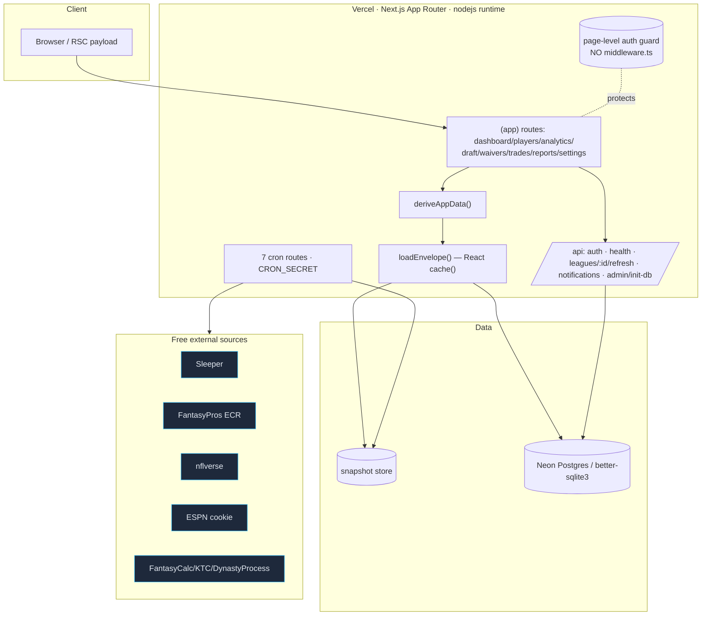
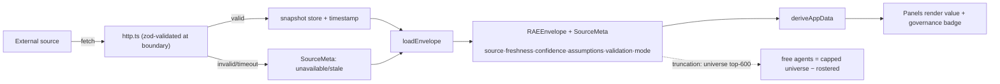
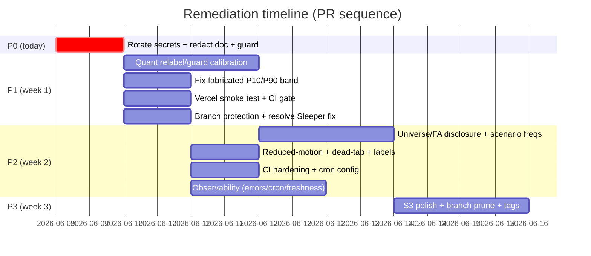

# RAE Fantasy Football Dashboard — Production-Grade Audit

**Date:** 2026-06-09 · **Branch audited:** `audit/2026-06-09` (== `origin/main` @ `0a5ac58`, current production)
**Deployment:** https://fantasy-football-dashboard-seven.vercel.app/ · **Repo:** github.com/jviola1019/fantasy_football_dashboard (**public**)
**Method:** 7 isolated workers (6 completed, auth/security completed by orchestrator after worker stall) + local gates + live runtime (Playwright) + live public-data probes. Evidence is code-first; docs treated as claims.

Per-dimension detail files (full evidence): `01-repo-map.md` · `02-quant-audit.md` · `03-data-pipeline-audit.md` · `04-uiux-audit.md` · `05-auth-security-audit.md` · `06-deployment-ci-audit.md` · `07-branch-diff-audit.md` · live probes `_live-probes.md` · screenshots `screens/`.

---

## 1. Executive summary

RAE is a genuinely well-engineered personal analytics app that is **far above generic-template quality** in three areas the brand cares about: **governance plumbing** (zod-validated source boundaries, a `SourceMeta` lineage object carried end-to-end, always-on demo/fixture labeling), **determinism** (seeded `mulberry32`, no `Math.random` in any displayed path), and **security engineering** (AES-256-GCM with no fallback key, scrypt + timing-safe password verify, per-user-scoped queries). Local gates are green: **typecheck ✓, lint ✓, vitest 442 passed / 6 skipped**, and the live `/dashboard` renders with **0 console errors**.

It has **one critical operational failure and one critical brand-credibility gap**:

1. **S0 — Live secret exposure.** Three real production secrets (`AUTH_SECRET`, `CREDENTIAL_ENCRYPTION_KEY`, `DB_INIT_TOKEN`) are committed in plaintext in `DEPLOY_TO_VERCEL.md` on a **public** repo and are anonymously fetchable right now (`raw.githubusercontent.com/...` → HTTP 200). Requires immediate **rotation** (deletion does not un-leak).

2. **S1 — Calibration theater.** For a product branded "model-governed," the season simulation presents **uncalibrated heuristic probabilities with the visual trappings of calibration**: hand-tuned weights (`models.ts`), a fixed `±(1−confidence)·18` band rendered as a "95% Confidence Band," and a Brier-backtest report that prints production targets (`playoff ≤0.20, championship ≤0.10`) it **never actually measures** — the backtest scores a *different* quantity (weekly start/sit projection discrimination). Plus one outright violation of the project's own "Never hardcode probabilities" rule: a fabricated `P10/P90` win band (`TeamSignals.tsx`).

Everything else is a finite, well-scoped list of S2/S3 polish, CI-hardening, observability, and branch-hygiene items. **The suspicions in the brief were a mix of confirmed (universe truncation; sim uncalibrated) and refuted (trade-value comment/code mismatch; ambiguous public labels) — verdicts in §5.**

**Verdict:** Production-*viable* for a single-owner hobby app the moment the S0 is rotated; **not** "production-safe model governance" until the calibration-theater items (§6) are relabeled or backed by a real calibration harness.

---

## 2. Current architecture & runtime topology

- **Framework:** Next.js App Router (`latest`), React 19, deployed on Vercel (`nodejs` runtime, Fluid Compute). One route group `(app)` behind an onboarding `/`.
- **Data model:** a single request-cached `loadEnvelope()` (`src/lib/envelope/load.ts`, wrapped in React `cache()`) builds a `RAEEnvelope`; `deriveAppData()` (`src/lib/envelope/derive.ts`) shapes it; every route renders through a shared `RouteView`. Pre-draft shows the whole-league universe; post-draft shows free agents (universe − rostered).
- **Persistence:** dual driver (`src/db`) — `postgres-js` (Neon) in prod when `DATABASE_URL` starts `postgres://`, else local `better-sqlite3`. No `drizzle/` migrations folder; schema bootstrapped via the token-gated `/api/admin/init-db` route (`INIT_SQL`).
- **Auth:** next-auth v5 (beta), Credentials provider, **JWT** sessions, DrizzleAdapter, `trustHost: true`.
- **Background:** 7 Vercel cron routes write timestamped snapshots (players, projections, rankings, opportunity, news, ktc, lifecycle); all `CRON_SECRET`-guarded.
- **External sources (all free):** Sleeper (identity/rosters/trending/projections), FantasyPros ECR (scrape), nflverse (snap/opportunity), ESPN (cookie-encrypted league/news), FantasyCalc/KTC/DynastyProcess (trade values), open-meteo (weather).

### Architecture (runtime topology)


### Data-flow (provenance)


### Component relationships (app shell)
```mermaid
flowchart TB
  AS[AppShell] --> RS[RouteSidebar]
  AS --> TC[TopCommandBar]
  AS --> MB[MobileBottomNav]
  AS --> GB[GovernanceBanner · global]
  AS --> RV[RouteView]
  RV --> MI[MarketIntelligence]
  RV --> NE[NarrativeEngine]
  RV --> NX[NexusSimulator · real bootstrap CI]
  RV --> DI[DraftIntelligence]
  RV --> WW[WaiverWire]
  RV --> TR[TradeCenter · client-fetch]
  RV --> DT[dashboard tiles: LeagueHealth/Pulse/TopInsights/NextBestActions]
  MI & NE & NX & DI -.uses.-> PT[PanelTabs · WAI-ARIA tablist]
  DT -.should use.-> SFB[SourceFreshnessBadge · today only mock-draft+reports]
  NX --> H2[Heatmap2D · P\(outcome\|wins\)]
  classDef dead fill:#3b1e1e,stroke:#ef4444;
  XX[ui/tabs.tsx · DEAD · 0 imports]:::dead
```

---

## 3. Repo & branch map (detail: `01-repo-map.md`, `07-branch-diff-audit.md`)

- **Routes:** 12 pages (onboarding `/`, `/login`, `/mock-draft`, 9 `(app)` routes incl. settings/{account,leagues}) + 12 API routes (auth, 7 crons, health, leagues/:id/refresh, notifications, admin/init-db).
- **Env vars:** 15 distinct; 3 required prod (`AUTH_SECRET`, `CREDENTIAL_ENCRYPTION_KEY`, `CRON_SECRET`) + `DB_INIT_TOKEN`/`DATABASE_URL`; ESPN vars optional; `RAE_LIVE_*` gate live tests. Only `.env.example` tracked.
- **Tests:** 54 unit files (5 live-gated) + 10 e2e specs.
- **Dependency risk:** ~10 packages pinned `latest` (incl. `next`, `react`, `zod`, `typescript`, `vitest`) → reproducibility risk; `next-auth@5.0.0-beta.31` pre-stable; `better-sqlite3` native (blocks local Node-20 Windows builds; fine on CI Node-20 / local Node-25).
- **Branches:** 15 refs / 10 named. **14 refs fully merged → deletable.** **1 unmerged:** `origin/claude/redesign-output-dashboard-Homgq` (4 commits; 3 are prohibited 3D/neon experiments, 1 = `71925df` Sleeper-adapter fix — **inspect before delete**). Local `main` 29 behind (ff-only safe). **Zero tags.**

---

## 4. Current strengths (verified, not assumed)

| Area | Evidence |
|---|---|
| Governed provenance | `SourceMeta` carries source/freshness/confidence/assumptions/validation/mode end-to-end; zod-validated at every adapter boundary (`http.ts:57-74`); missing data labeled `unavailable`, never silently filled |
| Determinism | seeded `mulberry32` (`rng.ts`); **no `Math.random` in any displayed path** (only a cosmetic skeleton + a test) |
| Conditional-prob honesty | Outcome Multiverse correctly labeled `P(outcome\|wins)`, columns sum to 100%, enforced by `outcomeHeat.test.ts` |
| One calibrated model | trade-value pooled Spearman ρ=0.648 with honest gates (`docs/trade-calibration.md`) — the one empirically-validated component |
| Crypto | AES-256-GCM, per-msg IV+tag, **no fallback key** (`crypto.ts`); scrypt + `timingSafeEqual` (`passwords.ts`) |
| Account isolation | user-scoped queries `and(eq(userId), eq(id))` (`leagues.ts:73-89`); `e2e/07-no-shared-data.spec.ts` |
| Crons | all 7 `CRON_SECRET` timing-safe guarded, timestamped snapshots + prune; schedules reconcile 1:1 with routes |
| Envelope | single `cache()`-wrapped `loadEnvelope` feeds all routes; pre/post pool switch tested (`buildUniverse.test.ts`) |
| A11y baseline | per-route sr-only `<h1>`, PanelTabs roving-tabindex WAI-ARIA tablist, honest `<DataUnavailable>` |
| Runtime health | live `/dashboard` 0 console errors/warnings; `/settings/*`→307 `/login`; SSR'd (not a client shell) |

---

## 5. Brief-suspicion verdicts (code as source of truth)

| Suspicion | Verdict | Evidence |
|---|---|---|
| Core metrics hand-tuned vs fitted | **CONFIRMED** | `models.ts:3-21` literal weights; grid-search deferred `calibration.md:57` |
| Sim has structure but incomplete production calibration | **CONFIRMED** | Brier measures start/sit, not playoff/champ; targets printed never measured (`brier-backtest.ts:662`) |
| "Full universe" truncated | **CONFIRMED** | top-600 cap; FA derived from capped list (`toEnvelope.ts:132-134`) |
| Trade-value fallback comment/code mismatch | **REFUTED** | FantasyCalc→KTC→DynastyProcess→unavailable matches comments + docs |
| Public routes expose loading/ambiguous labels | **MOSTLY REFUTED** | strong DEMO/FIXTURE/confidence labeling, 0 console errors; minor loading-class presence only |
| Deployment docs expose secrets | **CONFIRMED (S0) — worse than first thought** | `DEPLOY_TO_VERCEL.md:34-36,52` AND `AUDIT.md:83-86` (found by the new guard): + `CRON_SECRET`, a 2nd `DB_INIT_TOKEN`, old Neon pw, a user password. Public repo, raw 200. Both redacted (`f363637`). |
| Pre/post continuity under-guarded | **PARTIALLY CONFIRMED** | formulas identical (no break) but no agreement test across live-vs-synthetic scale paths |

---

## 6. Quant / model audit (detail: `02-quant-audit.md`)

**Most important risk:** a user cannot distinguish "validated against reality" from "internally consistent heuristic." The dashboard wraps heuristics in calibration vocabulary.

| ID | Sev·Conf | Finding | Evidence |
|---|---|---|---|
| QNT-01 | S1·H | Core metrics are hand-tuned linear weights, not fitted | `models.ts:3-21`; `fantasypros/enrich.ts:53-73` |
| QNT-02 | S1·H | `±(1−confidence)·18` heuristic band rendered as real CI; `confidence` itself heuristic | `models.ts:23`; `MarketIntelligence.tsx:162,170` |
| QNT-03 | S1·H | Brier report prints playoff/champ targets it never measures (scores a different quantity) | `brier-backtest.ts:662` |
| QNT-04 | S2·H | Scenario buckets use magic multipliers, not simulated frequencies | `derivedMetrics.ts:102,139,171-173` |
| QNT-05 | S2·H | No train/val/test split, no HP tuning, no ensembling in production | (offline backtest only; never feeds weights) |
| QNT-06 | S3·M | Pre/post formulas identical but live-vs-synthetic weekly-mean scale paths lack an agreement test | `seasonSim.ts` |

**Clean:** determinism; conditional-prob labeling; a real out-of-fold logistic calibration + Murphy decomposition exists *in the offline harness*; trade-value calibrated.

---

## 7. Data-pipeline audit (detail: `03-data-pipeline-audit.md`)

| ID | Sev·Conf | Finding | Evidence |
|---|---|---|---|
| DAT-01 | S2·H | Free agents derived from already-truncated top-600 universe; no "showing top N" disclosure | `toEnvelope.ts:132-134` |
| DAT-02 | S3·H | `UNIVERSE_LIMIT=600` duplicated, drift risk | `toEnvelope.ts:32`, `load.ts:205` |
| DAT-03 | S3·H | KTC/DynastyProcess hardcode `freshness:"stale"` + fresh `fetchedAt` (honest under-claim) | `values.ts:194,213` |
| DAT-04 | S3·H | `RAE_ENABLE_LIVE_HOMEPAGE` returns empty `unavailable` envelope (stub foot-gun) | `sleeper/players.ts:28-99` |
| DAT-05 | S3·M | Demo universe enriched without trending/news (declared missing, understates a free signal) | `load.ts:203` |
| DAT-06 | S3·M | Doc line-anchor drift | `data-source-map.md:34` vs `toEnvelope.ts:181-187` |

**Clean:** boundary zod validation; full `SourceMeta` lineage; honest missing-data labeling; cron idempotence + timestamps; `cache()` envelope; fixtures always labeled (`confidence:0.42`). **Trade-value comment/code mismatch: not found.**

---

## 8. Auth / security audit (detail: `05-auth-security-audit.md`)

| ID | Sev·Conf | Finding | Evidence |
|---|---|---|---|
| SEC-01 | **S0·H** | **Real prod secrets committed in public repo; rotation required.** Two leak sites: `DEPLOY_TO_VERCEL.md` (`AUTH_SECRET`/`CREDENTIAL_ENCRYPTION_KEY`/`DB_INIT_TOKEN`) + `AUDIT.md:83-86` (`CRON_SECRET`/2nd `DB_INIT_TOKEN`/old Neon pw/user pw). Redacted `f363637`; **rotation still required**. | `DEPLOY_TO_VERCEL.md:34-36,52`; `AUDIT.md:83-86`; raw 200; `ec2662b`→HEAD |
| SEC-02 | S3·M | No `middleware.ts`; protection is page-level (defense-in-depth gap) | `/settings/*`→307 works, but no chokepoint |
| SEC-03 | S3·L | `/api/health` discloses config-presence booleans | live probe |
| SEC-04 | S3·L | scrypt default cost params (undocumented/untuned) | `passwords.ts` |
| SEC-05 | S3·L | `init-db` returns raw error detail (token-gated, acceptable) | `route.ts:42-44` |

**Clean:** AES-256-GCM no-fallback-key; scrypt+timing-safe; user-scoped isolation; idempotent token-gated init-db; `CRON_SECRET` crons.

---

## 9. UI/UX audit (detail + wireframes: `04-uiux-audit.md`)

| ID | Sev·Conf | Finding | Evidence |
|---|---|---|---|
| UX-01 | **S1·H** | Fabricated `P10/P90` win band (`×0.68`/`×1.32`) — violates "Never hardcode probabilities" | `TeamSignals.tsx:36-61` |
| UX-02 | S2·H | Framer-Motion tweens ignore reduced-motion (Nexus path-draw/REPLAY) | `NexusSimulator.tsx:218-227,75-99` |
| UX-03 | S2·H | Dead Radix `ui/tabs.tsx` (0 imports) | grep |
| UX-04 | S2·M | "Multiverse" label collision (prob landscape vs static draft board) | `DraftIntelligence.tsx:17,91` |
| UX-05 | S3·M | Inconsistent no-envelope honesty default (`ready` vs `unavailable`) | Narrative/Waiver vs MarketIntelligence |
| UX-06 | S3·H | Per-panel source/freshness badge absent on route panels | `SourceFreshnessBadge` only in mock-draft/reports |
| UX-07 | S3·H | `Heatmap2D` aria-label generic vs actual `P(outcome\|wins)` | `role="img"` text |
| UX-08 | S3·M | `BackToDashboard` href `/` labeled "Dashboard" from anon routes | component default |
| UX-09 | S3·L | Duplicate `prefers-reduced-motion` block | `globals.css:139,1355` |
| UX-10 | S3·M | League Health shows `0.0` KPI (verify unavailable→0 coercion vs honest blank) | live `screens/audit-dashboard-desktop.png` — **needs confirm** |

**Clean:** single cached envelope; always-on GovernanceBanner; correct conditional labeling; excellent PanelTabs ARIA; sr-only `<h1>`; honest `<DataUnavailable>`; real bootstrap CI in Nexus; mobile targets ≥44px.

---

## 10. CI/CD & deployment audit (detail: `06-deployment-ci-audit.md`)

| ID | Sev·Conf | Finding |
|---|---|---|
| CID-01 | S1·H | Secrets in deploy doc (== SEC-01) |
| CID-02 | S1·H | No smoke test against live Vercel URL (CI only `localhost`) |
| CID-03 | S1·M | No branch-protection evidence — CI runs *after* push to `main`, not as a merge gate |
| CID-04 | S2·H | `opportunity-refresh` missing from `vercel.ts` functions config → default maxDuration (10s) timeout risk |
| CID-05 | S2·H | No cron failure alerting (`ok:false` consumed by nothing) |
| CID-06 | S2·H | Lighthouse `temporary-public-storage` (expires, public, untrendable) |
| CID-07 | S2·H | No `engines` field — no Node contract dev/CI/Vercel |
| CID-08 | S2·H | CI jobs parallel w/o `needs:`; `e2e`+`lighthouse` duplicate `next build`; failing gate doesn't abort downstream |

**Cron reconciliation:** all 7 routes scheduled, no orphans.

---

## 11. Observability audit

| ID | Sev | Gap | Recommendation |
|---|---|---|---|
| OBS-01 | S2 | No error tracking (no Sentry/log drain) | Add Sentry (free tier) or Vercel log drain; capture API + cron exceptions |
| OBS-02 | S2 | No cron success/failure alerting or uptime monitor | Wrap cron results; alert on `ok:false`; add an uptime check on `/api/health` |
| OBS-03 | S2 | No data-contract drift detection on snapshots | `scripts/check-cron-freshness.ts` in CI/cron to assert snapshot age + schema |
| OBS-04 | S3 | Lighthouse reports ephemeral | LHCI server or artifact upload for trends |
| OBS-05 | S3 | `/api/health` exists but nothing scrapes it | Point an uptime monitor at it |

---

## 12. Current → recommended (comparison)

| Dimension | Current | Recommended |
|---|---|---|
| Secrets | Real keys in public doc | Rotate + placeholders + `check-doc-secrets` CI guard |
| Sim probabilities | Heuristic, labeled like calibration | Either (a) relabel as "model estimate, not calibrated" + remove unmeasured targets, or (b) build the playoff/champ Brier harness that backs the labels |
| Uncertainty bands | Fixed `±(1−c)·18` shown as CI | Bootstrap CI from the sim distribution (Nexus already does this) or relabel "illustrative" |
| Universe | top-600 cap, FA from cap | Disclose "top N" or build FA from full pool; share one `UNIVERSE_LIMIT` |
| Route protection | Page-level only | Add `middleware.ts` matcher (defense-in-depth) |
| CI | Local-only gates, parallel, after-push | Add live smoke test, `needs:` ordering, branch protection, `engines` |
| Observability | None | Error tracking + cron alerting + freshness check |
| Branches/tags | 14 stale refs, 0 tags | Prune; ff local main; 5 semver tags |
| Deps | `latest` pins | Pin exact versions for reproducibility |

---

## 13. Prioritized action list

Severity S0–S3 · Effort XS/S/M/L · Owner: PLAT(form/devops), QUANT, FE(frontend), DATA, REL(ease-eng)

| Pri | ID(s) | Action | Sev | Eff | Owner | Risk if skipped |
|---|---|---|---|---|---|---|
| **P0** | SEC-01 | **Rotate `AUTH_SECRET`/`CREDENTIAL_ENCRYPTION_KEY`/`DB_INIT_TOKEN`** in Vercel; redact doc; add `check-doc-secrets` guard | S0 | S | PLAT | Account takeover / credential decryption |
| P1 | QNT-02/03 | Remove unmeasured Brier targets; relabel "95% CI" → honest band or back it with the sim distribution | S1 | M | QUANT | Brand-defining governance defect (false calibration) |
| P1 | UX-01 | Replace fabricated `P10/P90` with real distribution percentiles or relabel illustrative | S1 | S | FE | Rule violation; misleads users |
| P1 | CID-02 | Add `scripts/smoke-vercel.ts` + CI post-deploy smoke against prod URL | S1 | S | PLAT | Broken prod ships unnoticed |
| P1 | CID-03 | Enable branch protection + required checks on `main` | S1 | XS | REL | Unreviewed/broken merges |
| P1 | BR-02 | Diff & resolve `71925df` Sleeper fix, then prune `claude/*` branch | S1 | S | REL | Lost fix / branch rot |
| P2 | DAT-01/02 | Disclose top-N or build FA from full pool; single `UNIVERSE_LIMIT` | S2 | S | DATA | Waiver targets invisible |
| P2 | QNT-04 | Scenario buckets from real simulated frequencies | S2 | M | QUANT | Fabricated scenario odds |
| P2 | UX-02/03/04 | Reduced-motion for Motion; delete dead tabs; rename draft "Multiverse" | S2 | S | FE | A11y + confusion |
| P2 | CID-04/07/08 | `opportunity-refresh` function config; `engines`; CI `needs:`+build dedup | S2 | S | PLAT | Cron timeout; non-reproducible builds |
| P2 | OBS-01/02/03 | Error tracking + cron alerting + freshness check | S2 | M | PLAT | Silent prod/cron failures |
| P3 | SEC-02..05, DAT-03..06, UX-05..10, OBS-04/05, CID-06 | Hardening + polish | S3 | XS–S | mixed | Minor |
| P3 | BR-01/03/04 | Prune 14 stale refs; ff local `main`; add 5 semver tags | S3 | S | REL | Hygiene |

---

## 14. Branch / PR plan



**Branch hygiene now:** delete 14 merged refs; `git checkout main && git merge --ff-only origin/main`; tag `v0.5.0` at `0a5ac58`; create one PR per Pri block off `audit/2026-06-09`.

---

## 15. Tests to add / run

Already run (green): `npm run typecheck`, `npm run lint`, `npm run test` (442/6-skip). Not run locally (need server/browsers): `npm run e2e`, `npm run lighthouse`, `npm run build` (CI Node-20).

Add:
- `scripts/check-envelope-invariants.ts` — assert every `RAEEnvelope` panel carries a complete `SourceMeta` (source/freshness/confidence/assumptions/validation/mode); fail on null lineage.
- `prepost-continuity.test.ts` — invariant: pre-draft pool = universe; post-draft pool = universe − rostered; identity namespace stable; no negative FA set.
- `universe-subtraction.test.ts` — `FA = full − rostered` (not `capped − rostered`); disclosure flag present when truncated.
- `season-order.test.ts` — for all sim outputs: `0≤p≤1`, championship ≤ playoff ≤ 1, conditional columns sum to 100%.
- `ssr-leak.spec.ts` (e2e) — assert no skeleton/`animate-pulse` survives in the final SSR HTML of `/dashboard`,`/players`,`/analytics`.
- `account-isolation.api.spec.ts` (e2e) — user A `GET /api/leagues/<B's id>/refresh` → 403/404.
- `smoke-vercel` — `/`,`/login`,`/dashboard` 200 + `/settings/*`→login + `/api/health` ok, post-deploy.
- `check-doc-secrets` — fail if a base64/hex secret-shaped literal appears in tracked `*.md`/`*.json`/`*.env*`.

## 16. Scripts to add

| Script | Output | Purpose |
|---|---|---|
| `scripts/check-doc-secrets.ts` | exit 1 + offending file:line | P0 regression guard |
| `scripts/smoke-vercel.ts` | per-route status table; exit nonzero on fail | post-deploy verification |
| `scripts/check-envelope-invariants.ts` | lineage-coverage report | governance gate |
| `scripts/check-prepost-continuity.ts` | invariant pass/fail | pool correctness |
| `scripts/brier-season-sim.ts` | playoff/champ Brier + reliability curve | **make the printed targets real** |
| `scripts/check-cron-freshness.ts` | snapshot age + schema per source | data-contract drift |
| `scripts/audit-branches.ts` | ahead/behind/merged table | branch hygiene CI |

## 17. Open questions & unknowns (could not verify directly)

- Whether the leaked secrets have already been used (needs Vercel/Neon access logs).
- GitHub branch-protection / required-check settings (no repo-admin API access).
- Whether prod `leagueCredentials` holds real ESPN cookies (sets human impact of key rotation).
- Production telemetry backend — none found in code; confirm none exists in Vercel project.
- ESPN private-league live flow — untested (no credentials in this environment).
- The `UX-10` `0.0` League Health KPI — needs a code trace to confirm unavailable→0 coercion vs intended value.
- `claude/...Homgq` commit `71925df` — does its Sleeper-adapter change add anything not already in `d2c634b`?
